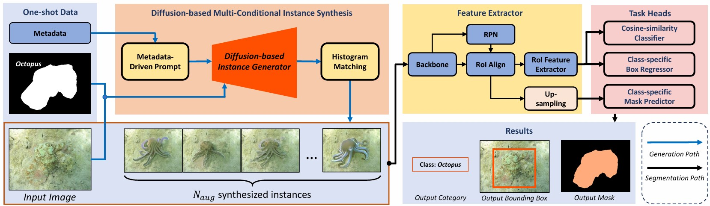

# CAMO-GenOS: Generative One-Shot Camouflage Instance Segmentation

This repository is the official implementation of the paper entitled: **Generative One-Shot Camouflage Instance Segmentation**. <br>

**Authors**: Thanh-Danh Nguyen, Vinh-Tiep Nguyen†, and Tam V. Nguyen.

> **Abstract:** 
Identifying camouflaged instances is a critical yet underexplored problem in computer vision, where traditional segmentation models often fail due to extreme visual similarity between foreground and background. While recent advances have shown promise with deep learning models, they heavily depend on large annotated datasets, which are costly and impractical to collect in camouflage scenarios. In this work, we tackle this limitation by introducing a novel framework, dubbed CAMO GenOS, that leverages one-shot annotated samples to drive a generative process for data enrichment. Our approach integrates prompt-guided and mask-conditioned generative mechanisms to synthesize diverse, high-fidelity camouflaged instances, thereby enhancing the learning capacity of segmentation models under minimal supervision. We demonstrate the effectiveness of our CAMO-GenOS by setting up a novel state-of-the-art baseline for one-shot camouflage instance segmentation research on the challenging CAMO-FS benchmark.

[[Paper]](https://doi.org/) [[Code]](https://github.com/danhntd/CAMO-GenOS) [[Project Page]](https://danhntd.github.io/projects.html)

---
## Updates
- **[2025/07]** We have released the initial page for CAMO-GenOS⚡!
- **[2025/07]** Added environment setup instructions

## 1. Environment Setup

### Requirements

- CUDA 12.x (tested on Docker container)

### Quick Start

1. **Build and start the container:**
   ```bash
   cd environment
   docker compose build
   docker compose up -d
   ```

2. **Enter the container:**
   ```bash
   docker exec -it mmlab_danhnt_fs /bin/bash
   ```

3. **Verify GPU access (inside container):**
   ```bash
   nvidia-smi
   conda info --envs
   ```

## 2. Data & Weights

### Dataset

The proposed CAMO-FS dataset is publicly available and can be downloaded from [Kaggle](https://www.kaggle.com/datasets/danhnt/camo-fs-dataset).

### Dataset Registration

This repository includes pre-configured dataset registration scripts for Detectron2. For detailed information about external dataset registration in Detectron2, please refer to the [official documentation](https://detectron2.readthedocs.io/en/latest/tutorials/datasets.html).

### Pre-trained Weights

Pre-trained model weights will be made available upon publication.

## 3. Training Pipeline

**Our proposed FS-CAMOFreq framework**



### Datasets

All training datasets are located in the `datasets/` directory. We recommend using aliases for better organization and management.

### Configuration

All training configurations are located in the `configs/` directory. Each configuration file contains detailed hyperparameters and training settings for different experimental setups.

### Training Commands

All training scripts are located in the `scripts/` directory. Detailed usage instructions and command examples are provided in the respective script files.
## 4. Citation

If you find this work useful for your research, please cite our paper:

```bibtex
@article{

}
```

## 5. Acknowledgements

We would like to acknowledge the following open-source projects that have contributed to this work:

- **[Detectron2](https://github.com/facebookresearch/detectron2.git)**
- **[iMTFA](https://github.com/danganea/iMTFA)**
- **[iFSRCNN](https://github.com/VinAIResearch/iFS-RCNN)**
